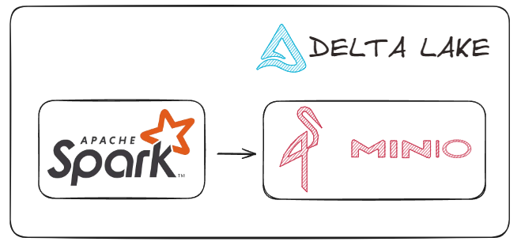

# Light Lakehouse

## Arquitetura


## Pré-requisitos
* Docker 

## Como desbloquear os pré-requisitos?

### Instalação do Docker

Tutorial vídeo: https://www.youtube.com/playlist?list=PLbPvnlmz6e_L_3Zw_fGtMcMY0eAOZnN-H

## Como subir os serviços do Lakehouse?
Step 1 --> Faça clone do projeto
```
git clone https://github.com/wlcamargo/lakehouse-light
```

Step 2 --> Entre na pasta do projeto
```
cd lakehouse-light
```

Step 3 --> Execute o comando para baixar as imagens e rodar os containers
```
docker compose up -d
```
## Como utilizar o Minio?

-----------------------------
localhost:9000

user: chapolin

password: mudar@123

-----------------------------

No acesso ao Minio, crie um bucket chamado ```bronze``` 

## Como utilizar o Spark?

### Entre no container do Spark 
```
docker exec spark-master /bin/bash
```

### Execute a aplicação Pyspark
```
spark-submit /opt/spark-apps/sample_write_table.py 
```

### Onde os Jars são salvos?
```
cd /opt/bitnami/spark/.ivy2/jars 
```

## Conclusão
Parabéns! Seu lakehouse light está pronto para o uso.


## Referência

https://github.com/kemonoske/spark-minio-delta-lakehouse-docker


## Desenvolvedor
| Desenvolvedor      | LinkedIn                                   | Email                        | Portfólio                              |
|--------------------|--------------------------------------------|------------------------------|----------------------------------------|
| Wallace Camargo    | [LinkedIn](https://www.linkedin.com/in/wallace-camargo-35b615171/) | wallacecpdg@gmail.com        | [Portfólio](https://wlcamargo.github.io/)   |